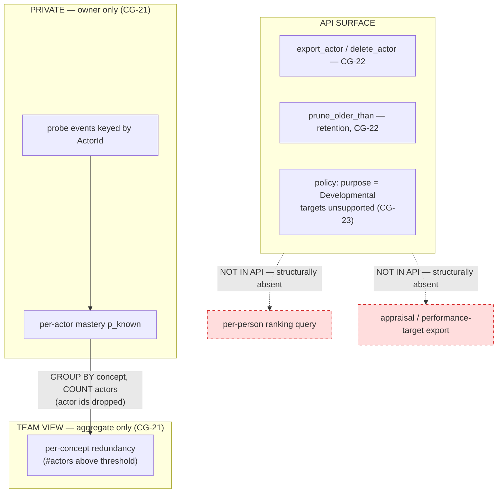

# W7 — Calibration ledger (`plugin-calibration-ledger`)

Implements **SoftDevSpec §2.2 row W7**: a SQLite-backed, per-person
confidence-vs-outcome record with a deterministic, BKT-style update rule.
The ledger is **developmental, never evaluative** (spec §1.6). It satisfies
**CG-4** (deterministic crediting), **CG-21**, **CG-22**, and **CG-23**.

## What it stores

Each *probe event* records, for one `ActorId` and one `ConceptId`, the person's
stated confidence (`predicted_correct`) and the graded outcome (`was_correct`),
plus a timestamp. From the running sequence of events the ledger maintains a
**mastery estimate** `p_known ∈ [0,1]` per (actor, concept) using a Bayesian
Knowledge Tracing (BKT) update.

## BKT update rule (deterministic — CG-4)

Four fixed parameters (no LLM, no learned weights — Phase-4 tuner candidate):

| symbol | meaning                                   | default |
|--------|-------------------------------------------|---------|
| `p_L0` | prior P(known) before any evidence        | 0.30    |
| `p_T`  | P(transit) — learning per opportunity     | 0.10    |
| `p_S`  | P(slip) — known but answers wrong         | 0.10    |
| `p_G`  | P(guess) — unknown but answers right      | 0.20    |

For a prior `p` and an observed `correct` outcome:

```
posterior =  if correct: p·(1−S) / ( p·(1−S) + (1−p)·G )
             else:       p·S     / ( p·S     + (1−p)·(1−G) )
p_next    =  posterior + (1 − posterior)·T
```

`p_next` becomes the stored mastery and the prior for the next event. The
arithmetic is pure `f64` with fixed constants, so replaying the same event
sequence always yields the same `p_known` (CG-4 determinism). The very first
event uses `p_L0` as its prior.

## Governance enforced at the storage layer (CG-21 / CG-22 / CG-23)



Governance is *structural*, not a runtime flag:

- **CG-21 — private by default.** Per-actor reads (`mastery`, `export_actor`,
  `delete_actor`) require the caller to name a specific actor — the intended use
  is the individual viewing their own data — and never return a cross-person
  ordering. The only cross-person query, `team_concept_redundancy`, returns
  `(ConceptId, count)` rows and drops actor ids inside the computation — no
  per-person column ever leaves storage. Binding a caller's identity to the
  actor they may read is an access-control concern for the embedding deployment
  (D15.4); this crate exposes no ranking primitive for one to misuse.
- **CG-22 — no ranking, retention, export, delete.** There is **no API method
  that ranks or orders people**, and none can be composed from the public
  surface (team queries expose only counts). `prune_older_than(days)` enforces
  retention; `export_actor` / `delete_actor` give the user export and erase.
- **CG-23 — developmental purpose, targets unsupported.** `LedgerPolicy`
  exposes only `Purpose::Developmental`; there is no field, type, or method for
  attaching a performance target. Attaching targets is unsupported *by API
  design*, not merely discouraged.

## SQLite pattern

Follows `plugin-logger-sqlite`: `Mutex<Connection>`, `open` / `in_memory`,
`init_schema`, `validate_db_path` (rejects `..` traversal), opaque SQLite error
mapping, and integrity errors on malformed stored rows (bad timestamp / bad
boolean encoding).
