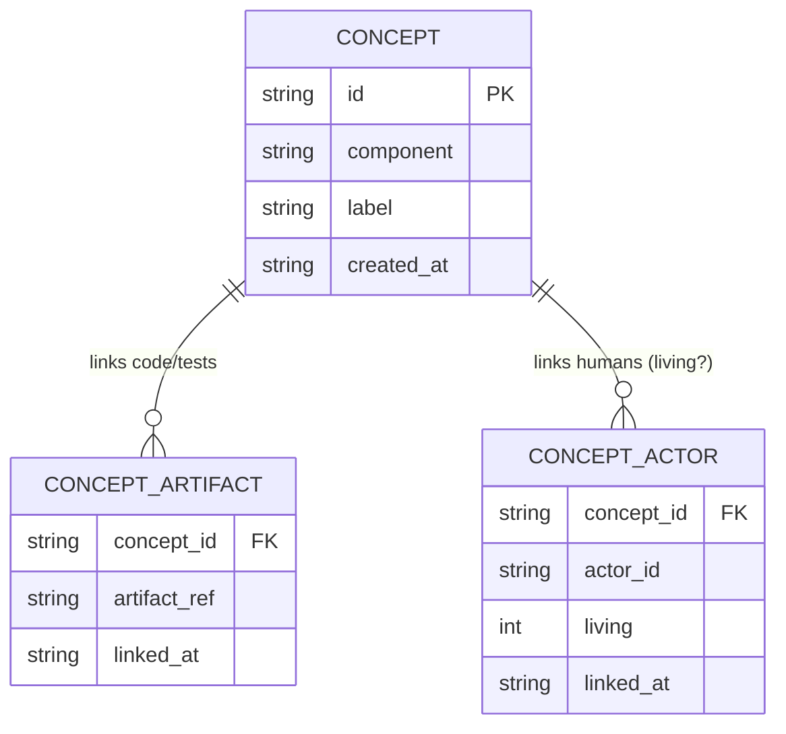

# W6 — Coverage map (`plugin-coverage-map`)

A SQLite-backed **concept inventory per component**, with links
**concept ↔ artifact** and **concept ↔ human** (`ActorId`). It is the substrate
the Hunt (W4) and probe ladder (W5) credit into, and the source of truth for
*dark-area detection*.

A **concept** is a named unit of comprehension territory inside a component
(e.g. `parser.unicode` — "malformed-unicode handling"). Coverage is tracked at
concept grain because that is the grain at which:

- the Hunt credits comprehension (**CG-6**: credit = instrumented execution
  trace ∩ coverage map), and
- the probe ladder decides where to fire (**CG-19**: probes trigger only for
  coverage-map areas *dark* after hunt/build/solo credit).

## Darkness

A concept is **dark** when it has **no living human link** — no `ActorId` row
with `living = 1`. Crucially:

- An **artifact** link does *not* lift darkness. Code/tests existing for a
  concept says nothing about whether a human comprehends it.
- A **decayed** human link (`living = 0`, the human left or comprehension
  lapsed) leaves the concept dark again.

`dark_concepts()` computes this deterministically with a left-anti-join
(`WHERE NOT EXISTS (… living = 1)`), ordered by concept id, satisfying the
determinism requirement CG-4/CG-19.

## Storage model

A concept with at least one `CONCEPT_ACTOR` where `living = 1` is **lit**;
otherwise it is **dark** regardless of how many artifacts it has.

`PRAGMA foreign_keys = ON` is set on open so the declared `REFERENCES
concepts(id)` constraints are actually enforced: orphan links to a non-existent
concept are rejected at the storage layer, not merely by the `ensure_concept_exists`
API check. Re-registering a concept (`add_concept`) refreshes `component`/`label`
but preserves the original `created_at`.

## Conventions

Follows the `plugin-logger-sqlite` pattern: `CoverageMap { conn: Mutex<Connection> }`,
`open(path)` / `in_memory()` constructors, private `init_schema()`, real paths
validated by `wyrtloom_core::storage::validate_db_path`. Malformed stored rows
(e.g. a non-RFC-3339 timestamp) return `CoverageError::Storage("integrity
error: …")` rather than substituting a value; raw SQLite errors are mapped to
opaque strings. Reuses `wyrtloom_core::types::{ActorId, Timestamp}` and defines
the `ConceptId` newtype.
