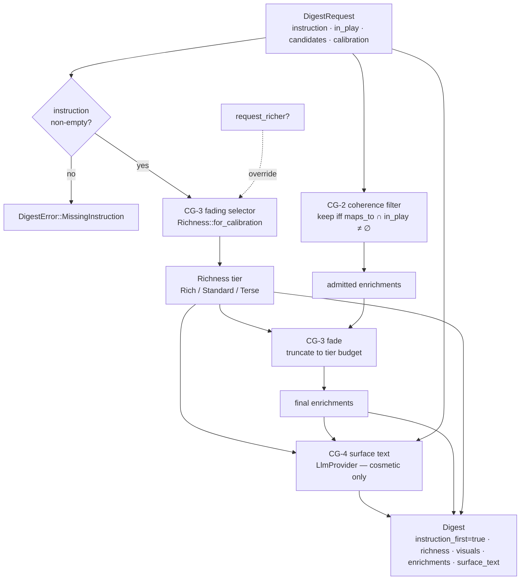

# W3 — Digest generator (`plugin-digest-generator`)

Implements Wyrtloom spec §2.2 row W3. A **digest** is the lesson shown when a
Kanban gate opens: *instruction always precedes any challenge* (CG-1). This
crate assembles that artifact deterministically and uses an `LlmProvider` only
to fill its decorative **surface text**.

## Rules

- **CG-1 — instruction-first.** A digest must carry instruction text. An empty
  instruction is rejected (`DigestError::MissingInstruction`), never a silent
  empty lesson.
- **CG-2 — coherence constraint (D15.1, seductive-details guard).** A candidate
  world-knowledge enrichment (threat intel, ecosystem news) is admitted *only*
  when at least one of the concepts it maps to is actually in play on the
  coverage map. Seductive-but-unmapped details are dropped. Interest must live
  in relevance, never alongside it.
- **CG-3 — artifact fading (D15.2, expertise-reversal guard).** Richness fades
  as the reader's calibration rises: `Rich` (low calibration) → `Standard` →
  `Terse` (high calibration). Fading trims both the visual count and the number
  of admitted enrichments. The reader can always request the richer form
  (`with_richer_form()`), which overrides the fade up to `Rich`.
- **CG-4 — determinism (R24).** The coherence filter, the fading selection, and
  every other decision are plain code, pure functions of their inputs. The
  `LlmProvider` fills **surface text only**; its output is never parsed for any
  decision and never grades or gates anything.

## Coverage-map concept

W3 does not yet depend on the sibling coverage-map crate, so it carries a local
`ConceptId` newtype. "In play" is just membership of a `ConceptId` in the
request's `in_play` list — the coherence filter is a set-intersection test.

## Assembly pipeline

The two deterministic stages (fading selector + coherence filter) feed the
artifact. The LLM is the final, purely cosmetic step and gates no decision.

## Tests

Contract tests (in `src/lib.rs`) use a deterministic **stub** `LlmProvider`
returning fixed text, and assert:

- CG-1: empty instruction rejected; well-formed digest flagged instruction-first.
- CG-2: unmapped/seductive enrichment dropped, mapped enrichment kept.
- CG-3: richness and enrichment count fade monotonically with calibration;
  richer form available on request.
- CG-4: surface text equals the stub's fixed string (cosmetic); structure is
  deterministic across identical inputs.
