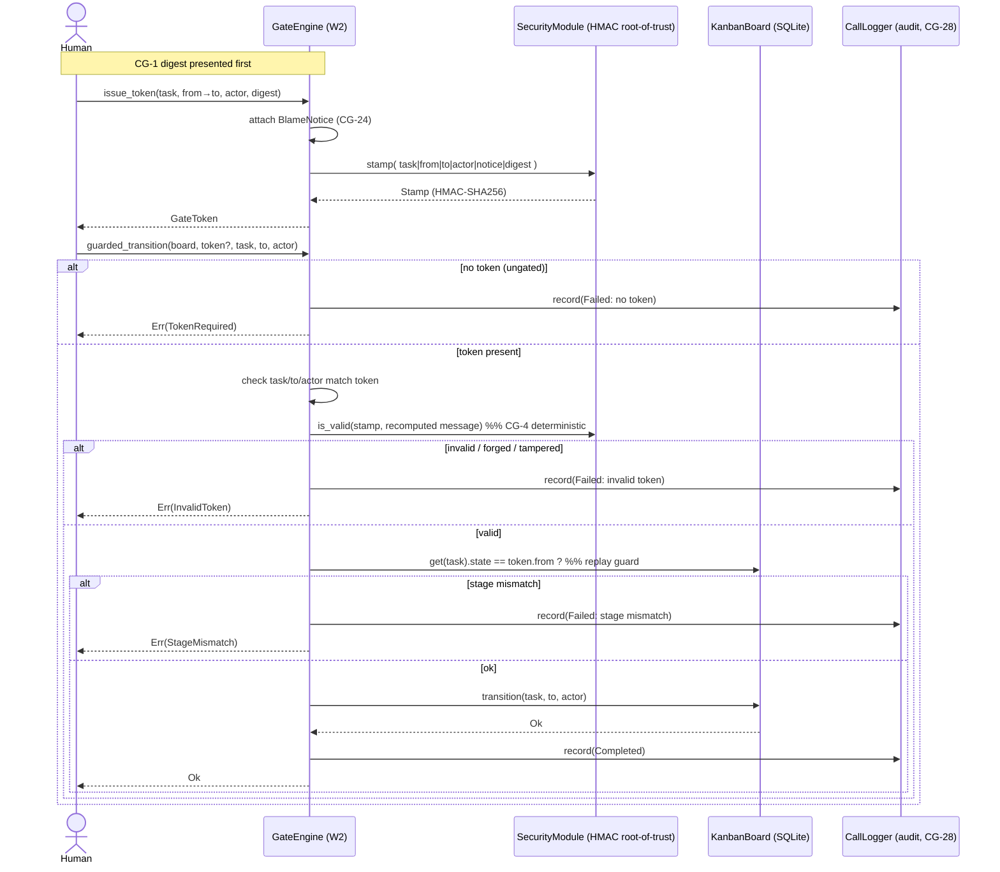

# W2 — Gate engine (`plugin-gate-engine`)

Guards Kanban transitions behind cryptographic **approval tokens**. A token is
an HMAC-SHA256 stamp (via `wyrtloom_core::security::SecurityModule::stamp`) over
the tuple `(task, from, to, actor, blame_notice, digest)`. A guarded transition
is refused unless a token is presented that validates for *exactly* that move;
every decision — refusal or success — is logged via a
`wyrtloom_core::logger::CallLogger`.

Implements SoftDevSpec §2.2 row **W2** and satisfies:

- **CG-1** — instruction-first: a token cannot be minted before a digest is
  presented (`issue_token` requires a non-empty `digest_summary`, which is bound
  into the HMAC).
- **CG-4** — deterministic pass/fail: validation is a pure HMAC comparison; no
  LLM grades anything.
- **CG-24** — every token carries a `BlameNotice` (*passage ≠ liability
  transfer*) bound into the HMAC, so it cannot be stripped without invalidating
  the token; the notice names the system-level incident-review template.
- **CG-28** — all gate events are logged via the call logger for audit.

## Why the blame notice is HMAC-bound

CG-24 requires the notice to *travel with* the approval. Rather than storing it
as detachable metadata, the notice text and review-template id are fed into the
same HMAC message as the task/stage/actor. Altering or removing the notice
changes the authenticated message, so `validate` rejects the token. The
guarantee "passage ≠ liability" is therefore cryptographic, not advisory.

## Token lifecycle (guarded transition)

## State guarded

The engine is transition-agnostic: it gates *any* `from→to` move the underlying
`KanbanBoard` considers legal (e.g. `Running→Done`, `Backlog→Todo`). Legality of
the move itself remains the board's responsibility (`is_legal_transition`); the
gate adds the authorisation and audit layer on top, plus a replay guard that
re-checks the board's current state equals the token's `from` before applying.

## Fail-closed auditing

A gate decision must never go unlogged (CG-28). If the `CallLogger` returns an
error, `guarded_transition` returns `GateError::Audit` rather than proceeding —
the operation fails closed.
