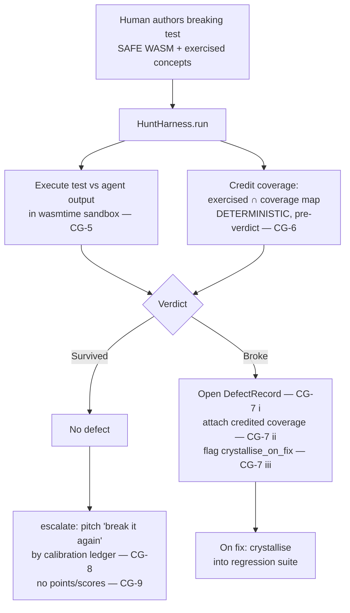

# W4 — Hunt harness (`plugin-hunt-harness`)

Implements spec §2.2 row W4 and the "The Hunt" constraints CG-5..CG-9 (with
CG-4 determinism).

## What it does

A human authors a *breaking test* — a SAFE WASM assertion module — and aims it
at the agent's output. The harness:

1. **Executes the test in the standard sandbox** (CG-5) via
   `wyrtloom_core::sandbox::SandboxRuntime` — in practice
   `plugin-sandbox-wasmtime::WasmtimeSandbox`. The agent output is the module
   input; the module's return buffer (or a trap) yields the verdict
   `Survived` / `Broke`.

2. **Credits coverage deterministically** (CG-4, CG-6). Each hunt-test declares
   the coverage-map concepts it *exercises* (its instrumented trace). Credit is
   the pure set intersection `exercised ∩ coverage_map`, computed **before** the
   verdict is consulted — so the same concepts are credited whether the test
   passes or breaks the target, with no LLM in the loop. `credit_coverage` is a
   total function over ordered `BTreeSet`s, so output is stable.

3. **On a break, opens a defect** (CG-7 i), carries the credited coverage
   (CG-7 ii), and flags the test to **crystallise into the regression suite on
   fix** (CG-7 iii) via `DefectRecord::crystallise_on_fix`. Blame stays with the
   system: a defect is a system signal, never a mark against the author.

4. **On survival, offers an escalated-stakes "break it again"** (CG-8),
   *pitched* by the calibration ledger and capped by `max_ladder_depth`. The
   calibration score only shapes the pitch's difficulty/tone — it is never a
   point, score, reward, or leaderboard (CG-9). The harness exposes no such
   statistics at all.

## Determinism (CG-4 / CG-6)

Crediting never calls a model and never depends on pass/break. It is a pure
function of `(declared exercised concepts, coverage map)`. Pass/break is decided
mechanically from the sandbox return value (non-zero first byte = held) or a
trap. The integration test asserts a passing and a breaking hunt credit
*identically*.

## Lifecycle



## Boundaries

* No dependency on sibling W-crates. The coverage concept is a local
  `ConceptId` newtype; the calibration ledger is a trait the consumer supplies.
* Reuses core types only: `sandbox::{SandboxRuntime, SafeModule,
  ResourceLimits, SandboxError}` and `types::{Bytes, TaskId}`.
* Only a sandbox **trap** counts as the test breaking the **target**. Every
  other sandbox error — compile failure, timeout, OOM, host-access attempt — is
  a failure of the *test harness* and surfaces as `HuntError::Harness`, never a
  defect. Timeouts/OOM are wall-clock/host-load dependent, so recording them as
  defects would violate CG-4 determinism.
```
