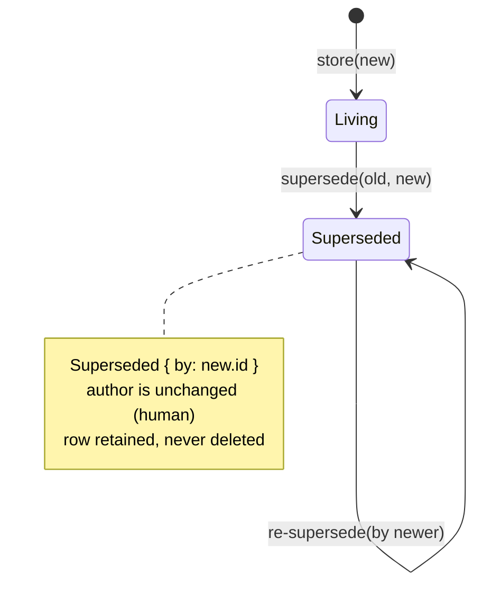
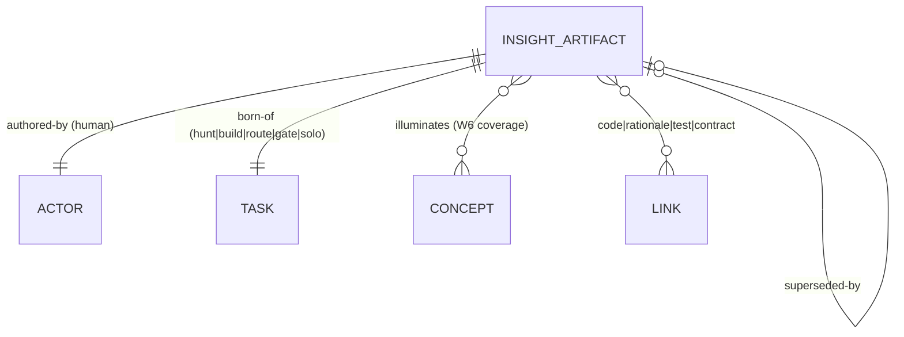

# W9 — Insight Artifact (`plugin-insight-artifact`)

A first-class, typed, SQLite-backed home for human **abstraction** and **novel
explanation**, sitting beside code, tests, and documentation
(SoftDevSpec §1.4, D14.2, §2.5). This is where the human's distinctive
contribution stops being ephemeral.

**Implements:** SoftDevSpec §2.2 row W9 + §2.5.
**Satisfies:** CG-27 — *Insight Artifacts SHALL be typed, linkable from
coverage-map concepts, rationale entries, and code; authorship is human;
capture labor is agent's.*

## Authorship vs. capture

Authorship is **human**: `author: ActorId` always names a real person, and a
supersession never changes it. The **capture labor** — persisting, linking,
superseding — is the agent's, and is exactly what this plugin performs. The
human supplies the explanation; the system makes it durable and linkable.

## Schema (§2.5)

| field         | type                                                    | notes |
|---------------|---------------------------------------------------------|-------|
| `id`          | `Uuid`                                                  | primary key |
| `author`      | `ActorId` (core)                                        | human |
| `created_at`  | `Timestamp` (core)                                      | RFC 3339 |
| `abstraction` | `text`                                                  | the novel explanation |
| `born_of`     | `BornOf` = hunt \| build \| route \| gate \| solo_flight | each carries a real `TaskId` |
| `concepts`    | `[ConceptId]`                                           | coverage-map (W6) links — JSON |
| `links`       | `[Link]` = code \| rationale \| test \| contract        | JSON |
| `status`      | `Status` = living \| superseded(by)                     | JSON |

`born_of`, `concepts`, `links`, and `status` are stored as JSON columns via
`serde_json`, following the SQLite-plugin convention for compound fields. Core
types (`ActorId`, `TaskId`, `Timestamp`) are reused; `ConceptId`, `BornOf`,
`Link`, and `Status` are local newtypes/enums.

## Storage pattern

Mirrors `plugin-logger-sqlite`: `Mutex<Connection>`, `open` /
`in_memory` / `init_schema`, `validate_db_path` for `..` traversal defence,
opaque SQLite error mapping (raw details never escape the public API), and
**integrity errors** on any malformed persisted row.

## Status state machine

An insight is never deleted — a deeper explanation *supersedes* it, preserving
the chain of understanding.

## Link / entity model

## API surface

- `SqliteInsightStore::open(path)` / `in_memory()` — open with traversal check.
- `store(&artifact)` — persist (capture labor; CG-27).
- `get(id)` → `Option<InsightArtifact>` — single fetch.
- `all()` → `Vec<InsightArtifact>` — ordered by `created_at`, `id`.
- `supersede(old, &new)` — persists `new` if absent, sets
  `old.status = Superseded { by: new.id }`; `NotFound` if `old` is absent.

## Testing

Contract tests precede behaviour; the required **core integration test**
(`core_integration_store_link_and_supersede`) stores an artifact linked to a
coverage `ConceptId` and a real `TaskId`, round-trips it through `in_memory()`,
and asserts that superseding sets `status = superseded(by)` while the author
remains a real, human `ActorId`.
