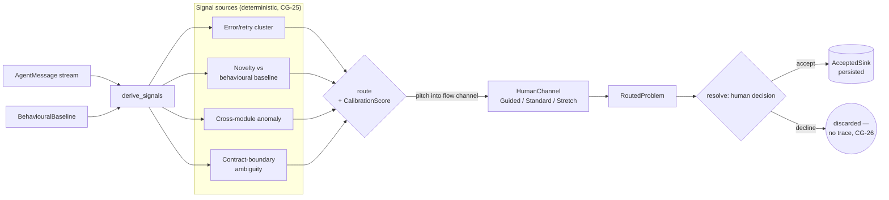

# W10 — Interest router (`plugin-interest-router`)

Implements Wyrtloom Conversation spec **§2.2 row W10**; satisfies **CG-25** and
**CG-26**.

## Purpose

The interest router watches the agent message stream and surfaces problems worth
a human's attention, then *pitches* each one into that human's flow channel —
neither boring nor overwhelming them. It is a **profile + plugin-layer**
construct: it adds no core component and depends only on
`wyrtloom_core::{agent, types}`.

## Determinism (CG-25 / CG-4)

All interest signals are **pure, deterministic functions** of the input
`AgentMessage` stream and a supplied `BehaviouralBaseline`. There is no LLM on
the path; the same input always yields the same signal vector and the same
routing. The four CG-25 signal kinds:

| Signal | Derivation |
|--------|-----------|
| `RetryFailureCluster` | ≥ `RETRY_CLUSTER_THRESHOLD` (3) `Error` messages share one `origin_task` |
| `NoveltyVsBaseline` | task unseen by baseline, or hop depth beyond baseline's normal max |
| `CrossModuleAnomaly` | an **error** message occurred more than one hop deep (depth taken from error messages only, so healthy deep traffic cannot fabricate it) |
| `ContractBoundaryAmbiguity` | a task with more `Delegation`s than matching `Result`s (unanswered hand-off) |

Tallies use `BTreeMap`/`BTreeSet` and a final `(task, kind, weight)` sort so the
output order is reproducible across processes.

## Pitch by calibration (CG-26)

The caller supplies a `CalibrationScore` in `[0,1]` (sourced from the W7
calibration ledger — the router does **not** import that crate). The score maps
deterministically to a `FlowChannel`:

- `< 0.34` → `Guided`
- `< 0.67` → `Standard`
- else → `Stretch`

## Decline leaves no trace (CG-26)

`resolve(problem, accepted)` is the only mutation point. On **accept**, the
problem is offered to the `AcceptedSink` and returned as `Accepted`. On
**decline**, the function returns `Declined` and the sink is *never touched* —
there is deliberately no ledger field, timestamp, or recipient kept on the
decline path. Declines leave no persisted trace.

## Flow



## Tests

- Unit tests (`src/lib.rs`): each signal kind, threshold boundaries, calibration
  validation/mapping, deterministic routing, accept-records / decline-no-trace.
- Core integration test (`tests/core_integration.rs`): real `AgentMessage`
  values (an `Error` retry cluster sharing `origin_task` plus an unanswered
  `Delegation`); asserts deterministic routing and that a decline persists
  nothing.
```
