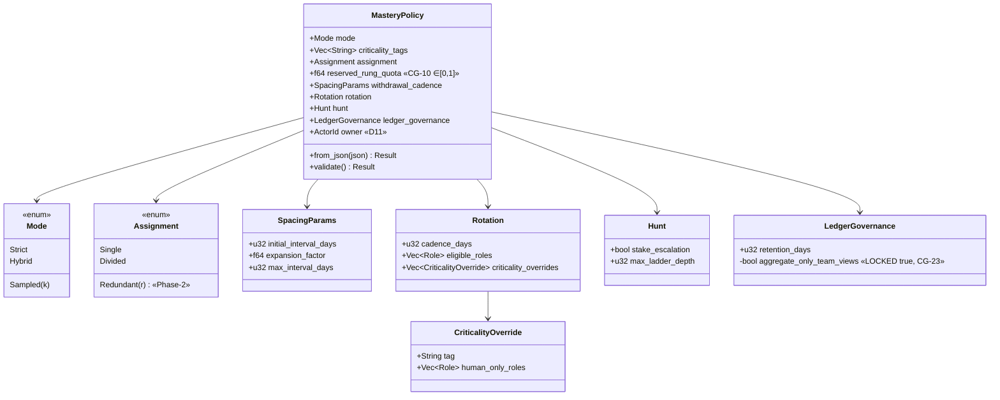
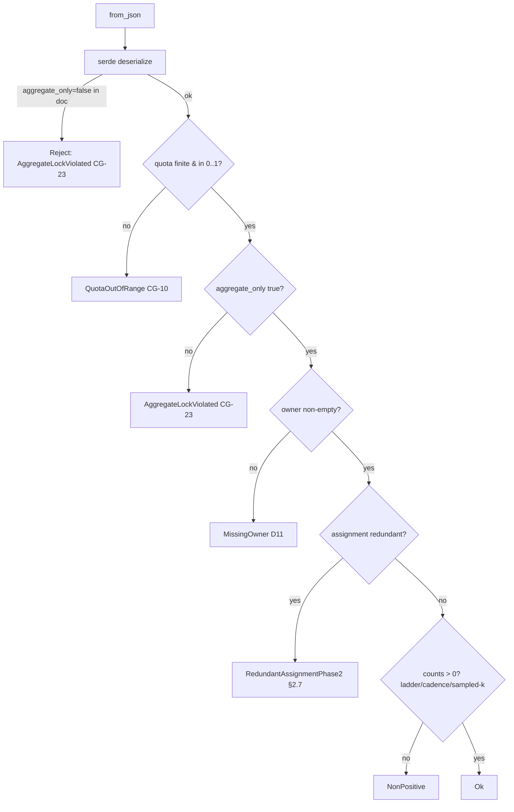

# W8 — Mastery policy (`plugin-mastery-policy`)

A typed, project-owner-governed configuration object for the Conversation
workflow layer, implementing SoftDevSpec **§2.4** (row **W8** of §2.2). It is a
pure data + validation crate: serde load, deterministic `validate()`, no I/O.

## Responsibilities

* Carry every §2.4 field in a typed schema (`mode`, `criticality_tags`,
  `assignment`, `reserved_rung_quota`, `withdrawal_cadence`, `rotation`,
  `hunt`, `ledger_governance`, `owner`).
* Enforce the constitutional-governance invariants it owns:
  * **CG-10** — `reserved_rung_quota` is a fraction in `[0.0, 1.0]`.
  * **CG-17** — rotation cadence / eligible roles / criticality overrides are
    first-class fields.
  * **CG-23** — `ledger_governance.aggregate_only_team_views` is **locked
    true**: per-person team views (a vector for performance targets) are
    inexpressible. The field has no public setter, defaults true, and its
    custom `Deserialize` rejects a `false` in the source document.
* Reuse the core actor identity: `owner: wyrtloom_core::types::ActorId`.

`assignment: redundant(R)` is **accepted but flagged** — redundant assignment
(R>1) is Phase-2 (§2.7), so `validate()` returns
`PolicyError::RedundantAssignmentPhase2`.

## Schema

## Validation decision flow

The CG-23 lock is enforced at **two** boundaries: the custom `Deserialize` (so
malicious or stale JSON never produces an unlocked policy) and `validate()`
(the authoritative gate for programmatically constructed policies).

## Phase notes

* `redundant(R)` assignment — Phase-2; accepted by the schema, flagged by
  `validate()`.
* Team transactive-memory views — Phase-2; the locked aggregate-only field is
  the forward-compatible guard so that, when introduced, only aggregate views
  are ever expressible (CG-23).
