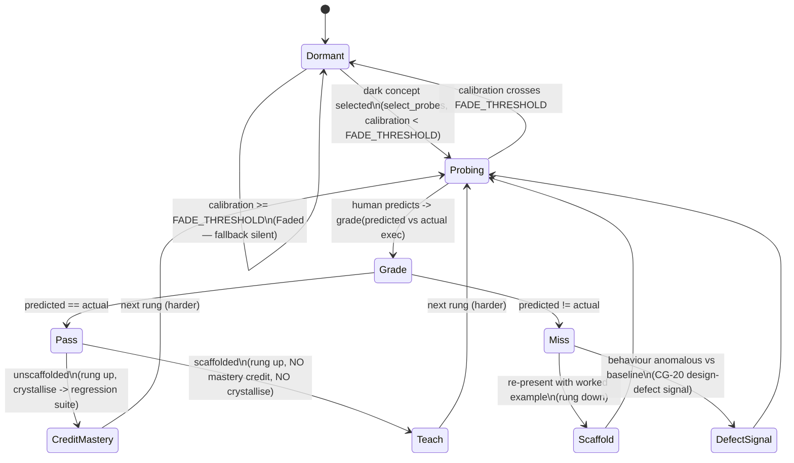

# W5 — Probe ladder (`plugin-probe-ladder`)

The probe ladder is the *quiet fallback* (§2.2 row W5, D8–D9). Where the Hunt,
Build & Own, and Scheduled Withdrawal leave coverage-map territory **dark**, the
ladder offers short **prediction probes**: the human predicts what a snippet
produces; the prediction is graded **by execution** — predicted output compared,
byte-for-byte, against the actual execution output. An LLM judge never grades
anything (CG-4; the addendum cites an F-HULA follow-up showing judge instability).

## Mechanics

- **Execution grading (CG-4, CG-18).** `grade(probe, actual_output)` is a pure
  function: `Pass` iff `predicted_output == actual_output`. Deterministic. No
  model is consulted in any pass/fail, crediting, or scheduling decision.
- **Staircase (CG-18).** Difficulty rises one `Rung` on a pass and falls one on
  a miss, saturating at `Intro` / `Expert`.
- **Scaffolds (CG-18).** After a miss the system can re-present the item *with a
  guided worked example*. A scaffolded item teaches but **never counts toward
  mastery** and **never crystallises** — `credits_mastery` and `crystallise` are
  both false for a scaffolded pass.
- **Crystallisation (CG-18).** An unscaffolded pass crystallises into the
  regression suite — tracked in `Ladder::crystallised()`.
- **Fading (CG-18).** `is_faded(calibration)` returns true at/above
  `FADE_THRESHOLD`; `select_probes` then returns `ProbeError::Faded` — the
  fallback goes silent for well-calibrated readers.
- **Triggering (CG-19).** `select_probes` fires only for dark concepts, per the
  mastery mode: `Strict` (all), `Sampled(K)` (first K, sorted), `Hybrid`
  (all criticality-tagged + a sample of the rest). Selection is deterministic.
- **Defect signal (CG-20).** A miss whose probe carries
  `behaviour_is_anomalous` (the observed system behaviour disagrees with the
  behavioural baseline) yields `Miss { defect_signal: true }` and is recorded in
  `Ladder::defect_signals()` — a *design-defect signal about the system*, never a
  record of human failing. A wrong-but-reasonable prediction is treated as a
  symptom, not a fault.

## State machine

## Reuse / boundaries

Coverage concepts (`ConceptId`) and the mastery mode (`MasteryMode`) are minimal
local types — this crate does **not** depend on sibling W-crates (the coverage
map W-* and mastery-policy W8 are authoritative elsewhere). Workspace deps:
`wyrtloom-core`, `serde`, `thiserror`.
