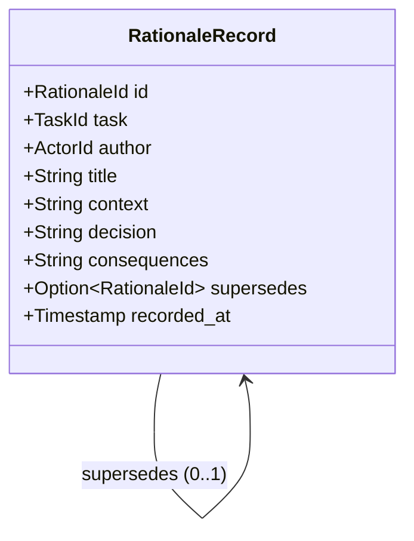
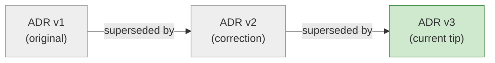

# W13 — Rationale ledger (`plugin-rationale-ledger`)

A SQLite-backed, **ADR-shaped** decision ledger and one of the four durable
artifact streams that the conversation sediments into (SoftDevSpec §1.4 item 2;
F11). It implements spec §2.2 row **W13** ("ADR-shaped decision records,
agent-authored") and supplies the immutable decision trail that the **CG-28**
audit requirement depends on.

## What a record is

Each record is an Architecture Decision Record: a **context** (the forces in
play), a **decision** (what was chosen), and **consequences** (the resulting
trade-offs). Every record is:

- **agent-authored** — carries an `ActorId` (§2.2 W13),
- **timestamped** — carries a real `Timestamp` (`recorded_at`),
- **task-linked** — carries a `TaskId`, so decisions are queryable per task
  (CG-28 linkability, under CG-21/22 access rules).

## Append-only / immutability invariant

The ledger is **append-only**. Once written, a record never changes: there is
deliberately **no update and no delete API** — the invariant is enforced
*structurally* by the absence of any mutation path, not by a runtime check.

A "correction" is therefore a **new** record whose `supersedes` field points at
the record it replaces, forming an auditable supersede chain. The original is
never altered or removed; `current_for_task` exposes only the un-superseded
tips, while `for_task` / `all` expose the entire history for audit.

### Supersede chain (corrections never mutate)

`current_for_task` returns only records that **no** later record supersedes
(here, `v3`). All three rows remain physically present so the full rationale
history is reconstructable for CG-28 audit.

## Storage shape

A single immutable table `rationale_records`, mirroring the Wyrtloom SQLite
plugin pattern (`Mutex<Connection>`, `open` / `in_memory` / `init_schema`,
`validate_db_path` against directory traversal, opaque SQLite error mapping, and
integrity errors — never silent coercion — on malformed `id` / `task_id` /
`supersedes` / `recorded_at` columns). Indexes on `task_id` and `supersedes`
keep per-task and current-view queries cheap.
