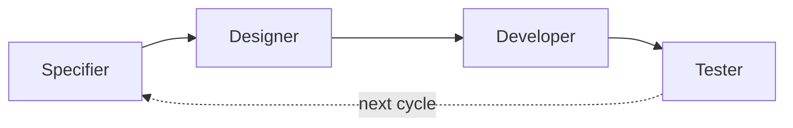
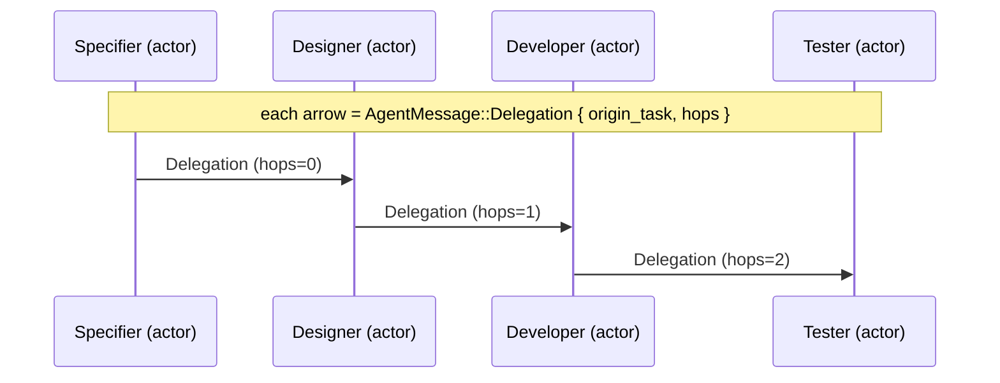

# W12 — Rotation scheduler (`plugin-rotation-scheduler`)

## Purpose

Assign the four conversation roles — **specifier → designer → developer →
tester** — to human and agent actors, then emit the resulting hand-offs over
the existing typed contract `wyrtloom_core::agent::AgentMessage`.

Spec mapping:

- **§2.2 row W12** — role assignment over typed handoff contracts.
- **CG-16** — rotation assigns the four roles to human *and* agent over the
  existing typed handoff contracts.
- **CG-17** — cadence and eligible roles are mastery-policy fields; rotation
  respects criticality tags (e.g. human-only specifier for safety-critical
  items if so configured).
- **CG-4** — assignment is deterministic. `RotationScheduler::assign` is a
  pure function of `(roster, cadence, eligible_roles, criticality, cycle)`;
  no LLM is involved.

The crate keeps `Role` and `Criticality` as minimal **local** config types so
it does not depend on sibling W-crates (e.g. mastery-policy). A deployment
projects the relevant mastery-policy fields onto `RotationPolicy`.

## Assignment model

For an item at rotation `cycle`:

1. `base = cycle / cadence` — the rotation advances one step per `cadence`
   cycles (CG-17 cadence).
2. Each eligible role is offset by its canonical ordinal, so distinct roles
   land on distinct actors when the roster is large enough:
   `actor = roster[(base + role.ordinal()) % roster.len()]`.
3. A criticality override (CG-17) pins a role to the **first human** in the
   roster, regardless of the rotation. If a human is required but none exists,
   assignment errors rather than silently seating an agent.

## Rotation cycle of roles

## Hand-off sequence over AgentMessage

One `AgentMessage::Delegation` is emitted per consecutive role transition,
each carrying the item's `origin_task` and a depth-tracking `hops` index so
the chain validates under the core hop limit (CG-16).

## Determinism (CG-4)

`assign` reads only its inputs and performs integer round-robin arithmetic —
no clocks, no randomness, no model calls. Identical inputs always yield an
identical `Assignment`, which is exercised by the contract test
`assignment_is_deterministic`.
