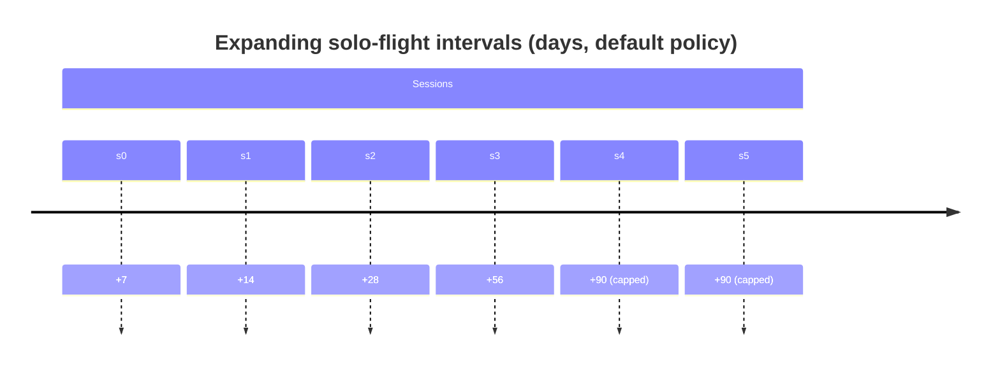

# W11 — Withdrawal scheduler (`plugin-withdrawal-scheduler`)

Plugin-layer component **W11** of the Wyrtloom "Conversation" workflow
(`SoftDevSpec.md` §2.2 row W11). It plans spaced **solo-flight** sessions for
each person so they periodically work a flagged task scope without the agent,
then folds the outcome back into the calibration ledger as developmental
practice.

## Constitutional guarantees

| CG | Requirement | Where |
| -- | ----------- | ----- |
| **CG-13** | Plan spaced solo-flight sessions per person from the calibration ledger; spacing = **expanding interval**. | `Scheduler::plan`, `ExpansionPolicy::interval_days` |
| **CG-14** | During a solo flight the agent is unavailable for the flagged scope **except via explicit human abort (logged, never penalised)**. | `SoloFlight` / `SoloFlightState`, `Scheduler::abort`, `PracticeEvent::penalised == false` |
| **CG-15** | Solo-flight outcomes update the ledger as **practice events, not assessments**. | `EventKind::Practice` (the only variant), `Scheduler::complete` / `abort` |

## Spacing algorithm (deterministic — CG-4 / CG-13)

The interval before the *n*-th session is a pure integer function:

```text
interval(n) = clamp( base_days * (factor_percent / 100)^n , .. , cap_days )
```

Computed by repeated integer multiply-then-divide-by-100 in `u64` with
saturation, so it is bit-for-bit reproducible on every platform — **no LLM, no
clock reads, no randomness.** Sessions are anchored at the seed's
`last_practiced` timestamp and offset by `prior_sessions`, so each successive
flight is spaced strictly further out (expanding retrieval practice) until the
`cap_days` ceiling. `Scheduler::new` rejects policies that would *not* expand —
including the integer-truncation trap where `base_days` is too small for
`factor_percent` (e.g. `1 * 150 / 100 = 1` forever) — unless the ladder is
immediately capped. `plan` uses saturating index and checked date arithmetic, so
it is a total function that never panics or wraps on extreme inputs.

With the default policy (`base=7`, `factor=200%`, `cap=90`):



## Solo-flight lifecycle (CG-14 / CG-15)

While a flight is `Active` the agent is **withdrawn** from the flagged scope.
The only exits are a normal completion (still practice) or an **explicit human
abort** — which pulls the agent back in, is logged, and is never penalised.
There is intentionally no `Assessment` event kind: recording a solo flight as a
scored assessment is unrepresentable in the API (CG-15 / CG-23).

```mermaid
stateDiagram-v2
    [*] --> Active : plan() then SoloFlight::begin()
    Active --> Completed : complete()  --> PracticeEvent{Flown, penalised=false}
    Active --> Aborted : abort(reason) [explicit human action]\n--> PracticeEvent{Aborted, penalised=false}
    Completed --> [*]
    Aborted --> [*]
    note right of Aborted
      CG-14: logged via CallLogger,
      agent un-withdrawn, never penalised
    end note
```

## Ledger integration

`PracticeEvent`s are emitted by `complete()` / `abort()` and rendered onto the
calibration ledger through `wyrtloom_core::logger::CallLogger`. They are written
as `CallOutcome::Partial` (developmental, non-terminal) — never
`CallOutcome::Failed` — so a solo flight or its abort can never be read back as
a penalising failure. The core integration test
(`tests/integration.rs`) drives the whole path against the real in-memory
`plugin-logger-sqlite` logger and asserts the abort is persisted as an
unpenalised practice event.
