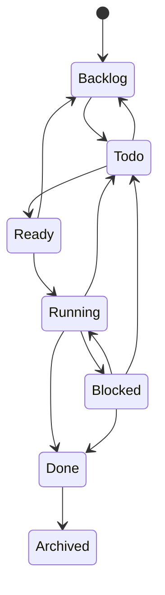
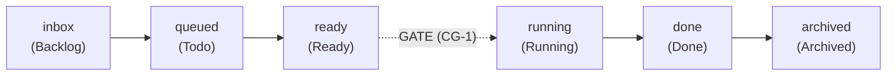

# W1 — Workflow profile (`plugin-workflow-profile`)

## Purpose

The workflow profile is the typed, in-memory configuration object at the root of
the Wyrtloom "Conversation" workflow layer (spec §2.2, row **W1**). It declares,
for one project:

- **Stages** — the Kanban *columns* work moves through. Each stage maps onto
  exactly one core [`TaskState`](../core/src/kanban.rs) so the board's existing
  legal-transition machinery still governs movement. ("Stages are Kanban
  columns" — §1.6.)
- **Gate placement** — which stage-to-stage edges are *guarded* (CG-1). The
  profile records only *where* gates sit; the gate engine (W2) enforces the
  instruction-first digest and validates the escalation-interface approval token
  at runtime.
- **Per-stage `TaskProfile`** — the [`TaskProfile`](../core/src/profile.rs) that
  bounds an agent's execution environment (and therefore cost — D2) while a task
  sits in a given column.

Zero new core components: this layer composes entirely from the locked core
(the Kanban state machine contract and the task-profile type). It is
serde-loadable from JSON, and *loading and validation are coupled* — there is no
way to obtain a valid profile without passing the deterministic checks.

## Validation rules (all deterministic — CG-4)

No LLM participates in any decision here; an identical profile always yields an
identical validation result.

1. At least one stage is declared.
2. Stage names are non-empty and unique.
3. No two stages map onto the same core `TaskState`.
4. The declared stage order is a **legal subset of the core Kanban state
   machine** — every adjacent declared pair is a legal core transition,
   delegated to `wyrtloom_core::kanban::is_legal_transition`.
5. Every gate references declared stages and sits on an adjacent declared-stage
   edge (CG-1 placement). Because of rule 4, any adjacent edge is guaranteed to
   be a legal core transition, so a gate can never be placed on an edge the core
   forbids.

## Core state machine subset

The profile rides — never redefines — the core state machine. The full legal
core graph (from `is_legal_transition`):



A workflow profile declares an *ordered* forward slice of this graph. The
canonical happy path, with a gate placed on `Ready -> Running`:



The dotted edge is a gate: a guarded transition whose digest-before-challenge
behaviour and approval-token check are W2's job. Validation here only confirms
that the gate sits on a declared, legal, adjacent edge.

## CG references

- **CG-1** — gate placement (this profile declares the guarded edges).
- **CG-4** — all validation is pure, deterministic code; no LLM grades anything.
- **D2** — per-stage `TaskProfile` bounds agent cost.

## Testing

Contract tests are written test-first (`#[cfg(test)] mod tests` in
`src/lib.rs`). They cover: the canonical profile, each rejection path
(empty profile, empty/duplicate stage name, duplicate state mapping, undeclared
gate target, gate off a declared edge, illegal stage order), JSON round-trip,
and rejection of malformed/invalid JSON. The **required core-integration test**
(`stage_order_is_legal_subset_of_core_state_machine`) maps declared stages onto
real `wyrtloom_core::kanban::TaskState` for the full
`Backlog -> Todo -> Ready -> Running -> Blocked -> Done -> Archived` path and
asserts, via core's own `is_legal_transition`, that every declared edge is
legal.
```
export PATH="/home/autumn/.hermes/profiles/coder/home/.rustup/toolchains/stable-x86_64-unknown-linux-gnu/bin:$PATH"
cargo build -p plugin-workflow-profile
cargo test  -p plugin-workflow-profile
```
